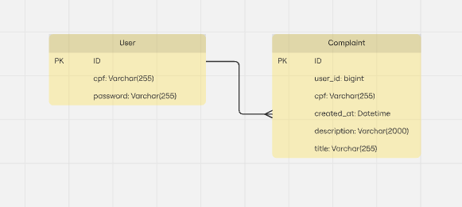

# Complaints API

API backend para gerenciamento de reclamações, desenvolvida com Spring Boot.



*Diagrama Entidade-Relacionamento do modelo de dados*

## Tecnologias

- Java 21
- Spring Boot 3.5.3 (Web, Security, Data JPA, Validation)
- JWT (Autenticação)
- MySQL (persistência)
- Lombok
- Maven

## Como rodar localmente

1. **Clone o repositório:**
   ```bash
   git clone <repo-url>
   cd complaints_api
   ```

2. **Configure o banco de dados:**
   - Crie um banco MySQL e ajuste as credenciais no arquivo `src/main/resources/application.properties`.

3. **Build e execute a aplicação:**
   ```bash
   ./mvnw spring-boot:run
   ```

4. **A API estará disponível em:**  
   `http://localhost:8080`

## Testes

Para rodar os testes:
```bash
./mvnw test
```

## Endpoints principais

- `/api/auth` - Autenticação (login, registro)
- `/api/complaints` - CRUD de reclamações

## Docker

Para rodar com Docker Compose:
```bash
docker-compose up --build
``` 